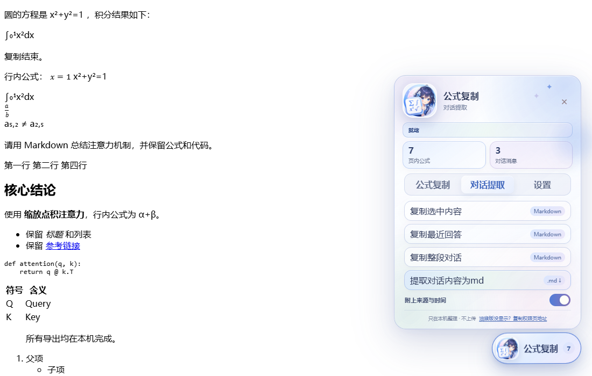

# ChatGPT 公式复制

[](https://github.com/yzhi51161-cmd/chatgpt-formula-copy/releases/latest)
[](./LICENSE)
[](https://raw.githubusercontent.com/yzhi51161-cmd/chatgpt-formula-copy/main/chatgpt-latex-copy.user.js)

[English](./README_EN.md) · [直接安装](https://raw.githubusercontent.com/yzhi51161-cmd/chatgpt-formula-copy/main/chatgpt-latex-copy.user.js) · [报告问题](https://github.com/yzhi51161-cmd/chatgpt-formula-copy/issues/new?template=bug_report.yml)

一个轻量、无网络请求的 ChatGPT 数学内容工具。公式、混合选区、回答和整段对话，都可以从同一个清爽的小面板里带走。

> 解决新版 ChatGPT 公式“可以选中，但复制不到原始 LaTeX”的问题。

<p align="center">
  
</p>

## 功能

- 兼容当前 `chatgpt.com` 的 `data-math-source` 公式结构。
- 默认输出 Markdown 数学格式：行内 `$...$`，独立公式 `$$...$$`。
- 自动清理首尾空白，并在不改变 LaTeX 语义的前提下压缩多余换行。
- 支持三种复制格式：Markdown 自动分隔符、始终行内分隔符、仅 LaTeX。
- 使用 Userscript 原生剪贴板 API，避免页面 Clipboard API 的权限限制。
- 支持流式生成和 SPA 页面更新；控制按钮被页面替换后由 `MutationObserver` 立即恢复，不再定时轮询。
- 支持整段复制增强：普通文字保持原顺序，公式自动转为 LaTeX。
- 支持复制最后一条 ChatGPT 回答为 Markdown。
- 支持把当前选区整理为 Markdown。
- 支持复制或下载完整对话为 Markdown，保留标题、粗体、列表、引用、代码块、表格、链接、图片引用和 LaTeX。
- 使用轻盈字体、高清蓝色 Logo 和留白更舒展的半透明复制 / 对话提取 / 设置面板。
- 设置页可在中文与 English UI 之间即时切换，选择会保存在本机。
- 使用线性公式去重、复用剪贴板后备节点和事件驱动恢复，降低大选区复制与页面常驻开销；每次交互重新读取公式源，避免流式回答产生陈旧结果。
- 内置窄范围公式 DOM 诊断，便于前端结构变化后的快速适配。

## 安装

> [!IMPORTANT]
> Chrome 138+ 使用 Tampermonkey 5.3+ 时，右键 Tampermonkey 图标 → **管理扩展程序** → 打开 **允许运行用户脚本（Allow User Scripts）**。Chrome 138 以前需要开启扩展管理页右上角的 **开发者模式**。
>
> Chrome 的警告是在说明 Tampermonkey 可以运行用户安装的脚本，并不是本项目额外申请的远程代码权限。请只安装你信任并检查过的 Userscript。
>
> 油猴版不会创建一个新的浏览器工具栏图标。它仍显示为 Tampermonkey 中的一条脚本，安装成功的标志是刷新 `https://chatgpt.com/` 后，页面右下角出现 **公式复制** 按钮。

### 一键安装

1. 安装 [Tampermonkey](https://www.tampermonkey.net/) 或 Violentmonkey。
2. 点击 [直接安装脚本](https://raw.githubusercontent.com/yzhi51161-cmd/chatgpt-formula-copy/main/chatgpt-latex-copy.user.js)。
3. 在脚本管理器的安装页面确认安装。
4. 按上方提示允许 Tampermonkey 运行用户脚本，然后打开或刷新 `https://chatgpt.com/`。
5. 页面右下角出现 **公式复制** 按钮，即表示脚本已成功运行。

该权限由 Chrome 管理。权限关闭时，Tampermonkey 无法注入本脚本，因此本脚本也无法检测状态或主动弹出权限引导。UI 底部提供“复制权限页地址”入口，但它只有在脚本已能运行时才会出现。

## 使用

直接单击 ChatGPT 回答中的公式。复制成功后，公式会短暂显示蓝色边框，并出现提示。

也可以框选一段包含文字与公式的回答，然后使用 Ctrl+C 或右键复制。脚本只在选区内检测到公式时接管复制；纯文字选区仍由浏览器正常处理。

```latex
$a_{i,j}=q_i^\top k_j$
```

```latex
$$\int_{-\infty}^{\infty}e^{-x^2}\,dx=\sqrt{\pi}$$
```

点击右下角 **公式复制** 可以：

- 在“复制”页切换公式格式并测试剪贴板；
- 在“对话提取”页复制选区、最近回答、完整对话或下载 `.md`；
- 在“设置”页暂停单击复制、关闭整段复制增强或复制诊断信息。

## 格式与兼容性

脚本优先读取新版 ChatGPT 的 `data-math-source`，并兼容 ARIA、KaTeX、MathML 及常见公式属性。多行公式会在安全时压成一行；`aligned`、矩阵、`\mathbf`、`\text{}` 等语义保持不变。

## 油猴版没有出现“公式复制”

按下面顺序排查，不要把所有情况都归因于同一个权限：

| 现象 | 处理方式 |
| --- | --- |
| 浏览器工具栏里没有单独的“公式复制”图标 | 油猴版不会创建独立图标；请查看 Tampermonkey Dashboard，并以 ChatGPT 页面右下角按钮作为运行成功标志 |
| Tampermonkey Dashboard 中找不到本脚本 | 使用 README 顶部的“直接安装”Raw 链接重新安装，而不是只下载 Release 附件 |
| 脚本存在且已启用，但任何网站都不运行 | Chrome 138+ 打开 Tampermonkey 的“允许用户脚本”；旧版 Chrome 打开开发者模式 |
| 权限已开，但只在 ChatGPT 不运行 | 检查 Tampermonkey 的“网站访问权限”是否允许 `chatgpt.com`，然后刷新页面 |
| Tampermonkey 显示脚本正在当前标签运行，但“公式复制”缺失 | 提交 Issue，并附上浏览器版本、脚本版本和控制台错误 |

参考：[Chrome userScripts 权限变更](https://developer.chrome.com/blog/chrome-userscript) · [Tampermonkey FAQ Q209](https://www.tampermonkey.net/faq.php?q=Q209)

## 隐私与权限

脚本会在本机轻量识别页面中的公式和可见消息用于显示数量；只有执行复制或整理操作时才转换相应内容。可选导出元数据包含当前标题、URL 和时间，并只写入用户生成的 Markdown。脚本不发起网络请求、不上传数据。失败诊断仅包含被点击公式自身的有限 DOM 摘要。

## 本地测试

```bash
npm install
npm test
npm run icons
npm run preview
```

`npm test` 会验证 Userscript、混合选区、Markdown 富文本导出、250 公式性能回归、控制器恢复和下载入口。

隐私说明见 [PRIVACY.md](./PRIVACY.md)。

## 参与贡献

发现公式无法复制或输出错误时，请使用 [Bug Report](https://github.com/yzhi51161-cmd/chatgpt-formula-copy/issues/new?template=bug_report.yml)，并只提供不含隐私信息的最小示例。

## License

[MIT](./LICENSE)

> 本项目为非官方工具，与 OpenAI 无隶属或授权关系。
