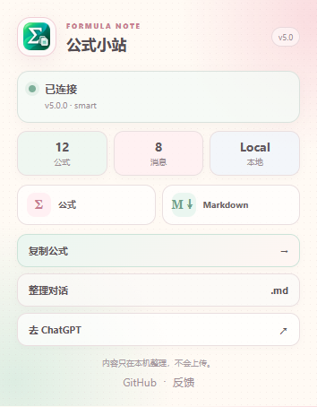

# ChatGPT Formula Nook

[](https://github.com/yzhi51161-cmd/chatgpt-formula-copy/releases/latest)
[](./LICENSE)
[](https://raw.githubusercontent.com/yzhi51161-cmd/chatgpt-formula-copy/main/chatgpt-latex-copy.user.js)

[简体中文](./README.md) · [Install](https://raw.githubusercontent.com/yzhi51161-cmd/chatgpt-formula-copy/main/chatgpt-latex-copy.user.js) · [Report a bug](https://github.com/yzhi51161-cmd/chatgpt-formula-copy/issues/new?template=bug_report.yml)

A lightweight, network-free ChatGPT math-content toolkit. Formulas, selections, answers, code, and whole conversations are all available from one calm little panel.

<p align="center">
  
  
</p>

## Why

Recent ChatGPT frontend changes can make formulas selectable without exposing the original LaTeX to ordinary clipboard extensions. This project extracts the rendered formula source locally and turns math-rich ChatGPT content into portable Markdown.

## Features

- Supports the current `data-math-source` structure on `chatgpt.com`.
- Falls back to KaTeX, MathML, ARIA, and common math data attributes.
- Offers automatic Markdown delimiters, always-inline delimiters, or raw LaTeX.
- Compacts unnecessary line breaks without changing LaTeX semantics.
- Handles streaming responses and SPA navigation.
- Converts formulas while copying a mixed text selection, without changing normal text-only copy behavior.
- Turns the current selection into Markdown.
- Copies the latest assistant code block or gathers every assistant code block in the conversation.
- Copies the latest answer or the full current conversation as Markdown.
- Downloads `.md` files while preserving headings, emphasis, lists, quotes, code blocks, tables, links, image references, and LaTeX.
- Uses linear formula deduplication, a reusable clipboard fallback, and event-driven control recovery instead of polling; formula source is read at interaction time so streaming updates never return stale LaTeX.
- Provides a light stationery-inspired three-tab panel and a Chrome popup with live connection status.
- Makes no network requests. Formula/message elements are counted locally; content is converted only when the user runs an action.

## Install

> [!IMPORTANT]
> **Chrome 138+ requires Tampermonkey users to enable “Allow User Scripts.”**
>
> Right-click the Tampermonkey toolbar icon → **Manage extension** → enable **Allow User Scripts**. On Chrome versions before 138, enable **Developer mode** on the extensions page instead.
>
> Chrome owns this permission. When it is disabled, the Userscript is never injected, so the script cannot detect the condition or enable the switch for you. After installation, refresh `https://chatgpt.com/`; the **公式小站** button confirms that the script is running.

1. Install [Tampermonkey](https://www.tampermonkey.net/) or Violentmonkey.
2. Open the [direct install link](https://raw.githubusercontent.com/yzhi51161-cmd/chatgpt-formula-copy/main/chatgpt-latex-copy.user.js).
3. Confirm installation in your Userscript manager.
4. Enable user scripts as described above and refresh `https://chatgpt.com/`.
5. Confirm that the **公式小站** button appears in the lower-right corner.

### Chrome extension

Run `npm run build:chrome` to create `dist/chatgpt-formula-copy-chrome-v5.0.0.zip`, with `manifest.json` correctly placed at the archive root. The MV3 extension uses a static content script and does not depend on Tampermonkey's user-script switch.

Enable either the Chrome extension or the Userscript, not both.

## Use

Click any formula in a ChatGPT answer. A green outline and toast confirm a successful copy.

You can also select a whole passage and press Ctrl+C or use the context-menu Copy command. Text keeps its order while formulas become Markdown-ready LaTeX.

```latex
$a_{i,j}=q_i^\top k_j$
```

Use **公式小站** to switch between:

- **Copy:** choose a formula format and test the clipboard.
- **Collect:** copy a selection, the latest answer, the latest/all code, the full conversation, or download `.md`.
- **Settings:** toggle click-to-copy and mixed-selection conversion, or collect a narrow diagnostic.

## Userscript troubleshooting

| Symptom | What to check |
| --- | --- |
| The script is missing from the Tampermonkey Dashboard | Install through the Raw `.user.js` link above instead of merely downloading a Release asset |
| The script is enabled but runs nowhere | On Chrome 138+, enable **Allow User Scripts**; on older Chrome, enable Developer mode |
| It runs elsewhere but not on ChatGPT | Allow Tampermonkey site access on `chatgpt.com`, then refresh |
| Tampermonkey says it is running but the green UI is missing | Open an Issue with browser version, script version, and console errors |

References: [Chrome userScripts permission change](https://developer.chrome.com/blog/chrome-userscript) · [Tampermonkey FAQ Q209](https://www.tampermonkey.net/faq.php?q=Q209)

## Development

```bash
npm install
npm test
npm run build:chrome
```

`npm test` covers the Userscript, MV3 package, mixed selections, rich Markdown export, a 250-formula performance regression, control recovery, popup messaging, and download entry points.

See [CHROME_WEB_STORE.md](./CHROME_WEB_STORE.md) for listing and review details, and [PRIVACY.md](./PRIVACY.md) for the privacy policy.

## Contributing

If a formula cannot be copied or is copied incorrectly, open a [bug report](https://github.com/yzhi51161-cmd/chatgpt-formula-copy/issues/new?template=bug_report.yml) with a non-sensitive minimal example.

## License

[MIT](./LICENSE)

> Unofficial community tool. Not affiliated with or endorsed by OpenAI.
